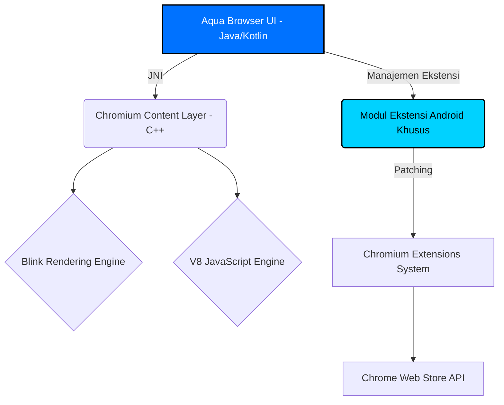

# 🌊 Arsitektur & Perencanaan Inti: Aqua Browser

Dokumen ini berisi penalaran mendalam, analisis teknis, dan cetak biru (blueprint) komprehensif untuk merealisasikan **Aqua Browser**—sebuah browser Android yang memiliki kapabilitas *desktop-grade* termasuk dukungan penuh terhadap ekstensi dari Chrome Web Store.

---

## 1. Realitas Teknis & Tantangan Utama

Sebagian besar browser di Android dibuat menggunakan `android.webkit.WebView` atau `GeckoView` (Mozilla). Namun, **komponen WebView bawaan Android tidak mendukung Ekstensi Chrome**.

Satu-satunya cara untuk membuat browser Android yang bisa memasang ekstensi langsung dari Chrome Web Store (menggunakan API `chrome.*` dan Manifest V2/V3) adalah dengan **melakukan fork (menyalin dan memodifikasi) *Source Code* Chromium secara langsung**. 

Membawa fungsionalitas Chrome Desktop ke Android bukanlah sekadar membuat antarmuka UI dengan Java/Kotlin. Secara default, kode sumber Chromium *menonaktifkan* modul ekstensi saat dikompilasi untuk Android. Oleh karena itu, kita harus melakukan modifikasi di tingkat bahasa C++ dan sistem *build* Chromium.

Proyek sukses yang pernah menempuh jalur ekstrem ini adalah **Kiwi Browser** dan **Lemur Browser**.

---

## 2. Arsitektur Aqua Browser

Aqua Browser akan berdiri di atas fondasi berikut:
*   **Engine Inti:** Blink (Rendering) dan V8 (JavaScript) dari proyek Chromium.
*   **Sistem Build:** `depot_tools` (GN dan Ninja).
*   **Modifikasi Lapisan Ekstensi:** Mengaktifkan flag `enable_extensions=true` untuk target OS Android, yang mana secara default dilarang oleh arsitektur asli Chromium.
*   **Antarmuka Pengguna (UI):** Ditulis dalam Java/Kotlin (berkomunikasi dengan *engine* C++ melalui JNI - *Java Native Interface*).

---

## 3. Langkah-Langkah Implementasi Maksimal (Blueprint)

### Fase 1: Persiapan Infrastruktur (Kebutuhan Sangat Tinggi)
Membangun Chromium untuk Android membutuhkan spesifikasi *machine* yang masif:
*   **OS:** Linux (Ubuntu 22.04 LTS sangat disarankan).
*   **CPU:** Prosesor 16-Core atau lebih.
*   **RAM:** Minimal 32 GB (disarankan 64 GB).
*   **Storage:** Minimal 150 GB SSD Kosong (Source code Chromium ukurannya belasan Gigabyte, dan artefak *build*-nya sangat besar).

### Fase 2: Sinkronisasi Kode Sumber Chromium
Kita tidak menggunakan Android Studio untuk kompilasi mesinnya, melainkan *toolchain* khusus Google.
1. Memasang `depot_tools`.
2. Mengunduh kode sumber via `fetch --nohooks android`.
3. Menjalankan `gclient sync`.

### Fase 3: Modifikasi C++ (The Core Magic)
Di sinilah penalaran terdalam diterapkan. Agar ekstensi dari Chrome Webstore bisa berjalan di Android:
1. **Modifikasi `args.gn`:** Kita harus memaksa sistem *build* untuk tidak mengabaikan *folder* `extensions/`. Kita perlu menyuntikkan `enable_extensions=true`.
2. **Patching Kompatibilitas UI Ekstensi:** Desktop Chrome menampilkan opsi ekstensi melalui *toolbar* (C++ Views). Di Android, kita harus mencegat panggilan *toolbar* C++ ini, dan meneruskannya (via JNI) ke antarmuka Java (Kotlin) agar ekstensi bisa muncul di *menu pop-up* Android.
3. **Mengelabui Chrome Web Store:** Chrome Web Store mendeteksi *User-Agent*. Kita harus memodifikasi kode Jaringan (Network Stack) Aqua Browser untuk mengirimkan *User-Agent* Desktop saat pengguna mengunjungi `chrome.google.com/webstore`, sehingga tombol "Add to Chrome" dapat diklik, bukan menampilkan tulisan "Not supported on your device".

### Fase 4: Desain & Tema (Theming)
Dukungan Tema dari Chrome Webstore berbasis pada manipulasi manifest `theme`.
*   Aqua Browser harus memiliki layanan khusus di lapisan UI yang membaca `manifest.json` dari file `.crx` tema yang diunduh.
*   Mengekstrak nilai warna latar belakang, gambar *tab background*, dan warna teks.
*   Menerapkannya secara dinamis pada `Toolbar` dan `NavigationBar` di Android secara real-time.

---

## 4. Tantangan "Fitur Setara Chrome Desktop Mutakhir"

Mengusung seluruh fitur desktop menghadirkan limitasi fundamental dari sisi sistem operasi mobile itu sendiri:

*   **Manajemen Memori (RAM):** Ekstensi Chrome sering kali memakan RAM yang besar (masing-masing berjalan di *background process/service worker*). Sistem OS Android secara agresif membunuh proses di *background* (*OOM Killer*). Aqua Browser perlu mengimplementasikan "Sleeping Tabs" atau mengontrol *Lifecycle* Ekstensi agar *smartphone* tidak mengalami *lag/freeze*.
*   **DevTools (Inspect Element):** Aqua Browser harus mem-porting DevTools frontend (HTML/JS) ke dalam *view* lokal sehingga pengguna bisa menekan "Inspect Element" dari layar HP dan melihat tab *Console/Network* seperti di desktop.

## 5. Ringkasan Eksekusi

Proyek **Aqua Browser** adalah proyek rekayasa perangkat lunak berskala besar. 
Bukannya menulis aplikasi Android biasa, Anda sesungguhnya sedang melakukan modifikasi inti sistem operasi browser (Blink/Chromium). Jika Anda siap, langkah nyata pertamanya adalah menyiapkan Server Linux (atau WSL 2 di spesifikasi tinggi) untuk mulai menarik kode dari repositori Chromium.
