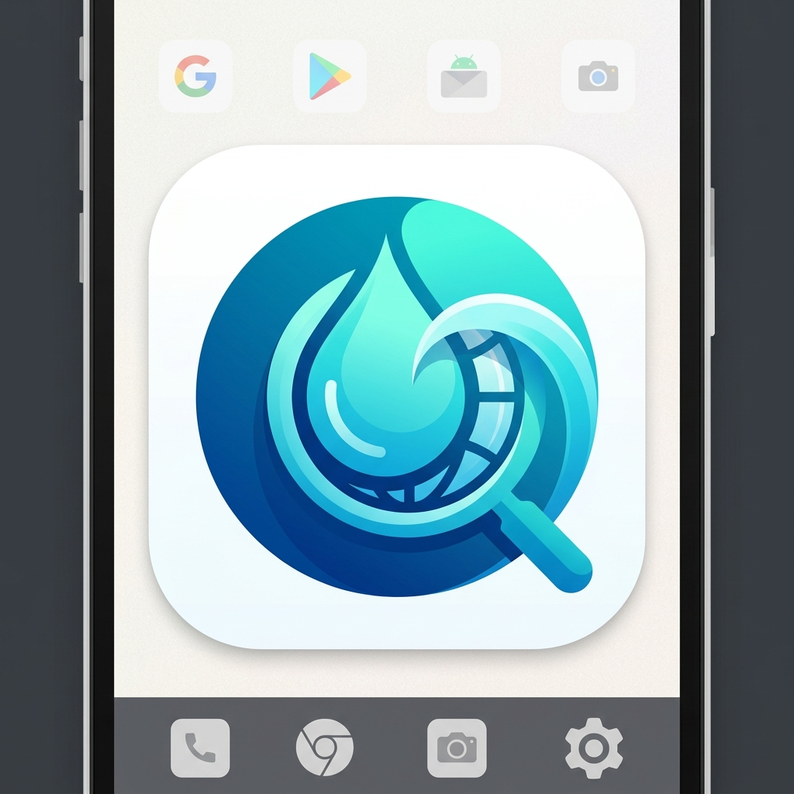
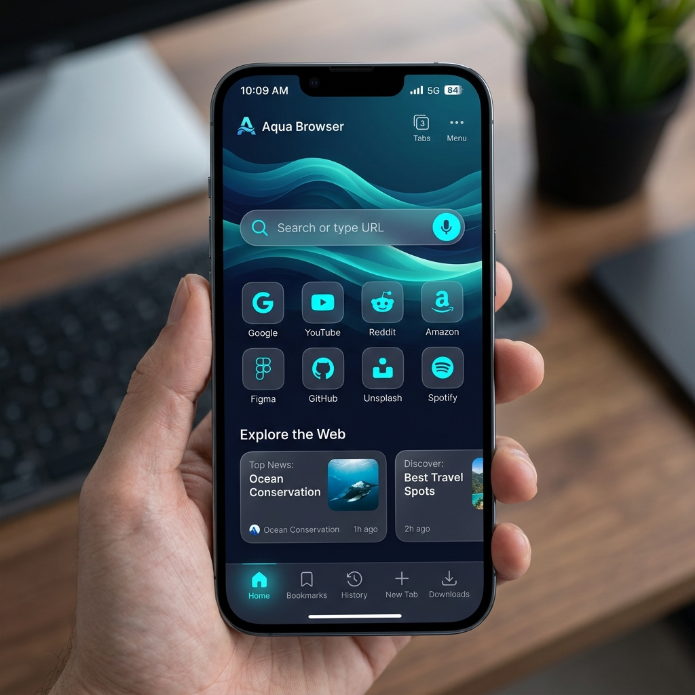
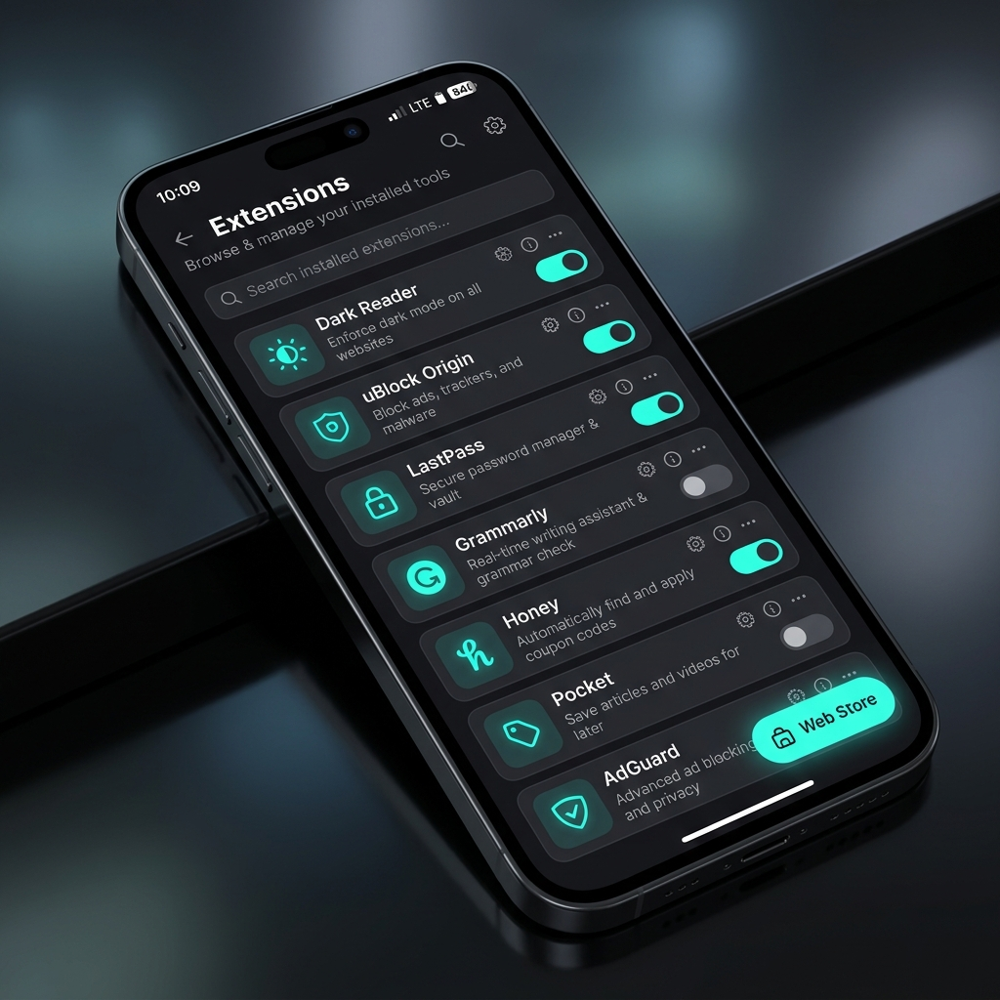

<div align="center">
  
  
  # 🌊 Aqua Browser
  
  **The full Desktop Chrome experience, engineered for Android.**

  [](#)
  [](#)
  [](#)
  [](https://opensource.org/licenses/MIT)

  [**Website Promosi (Landing Page)**](https://NanoMindExplorer.github.io/Aqua-Browser) • [**Baca Blueprint Arsitektur**](BLUEPRINT.md)
</div>

<br/>

## 🚀 Apa itu Aqua Browser?

Sebagian besar browser di Android hanyalah *wrapper* (pembungkus) dari `Android WebView` yang sangat dibatasi. **Aqua Browser berbeda.** 

Kami melakukan *forking* dan modifikasi tingkat rendah (C++) secara langsung terhadap mesin Chromium. Dengan menyuntikkan *compiler flags* khusus, Aqua Browser mendobrak batasan sistem Android dan mengaktifkan fitur-fitur kelas berat yang biasanya hanya ada di PC/Laptop.

## ✨ Fitur Unggulan

| Fitur | Deskripsi |
| :--- | :--- |
| 🧩 **Dukungan Ekstensi Penuh** | Pasang *uBlock Origin*, *Grammarly*, *Dark Reader*, dll langsung dari **Chrome Web Store** tanpa batasan. |
| 🎨 **Dynamic Theme Engine** | Unduh Tema dari Chrome Webstore. Mesin internal kami akan membedah `manifest.json` dan mewarnai ulang antarmuka Android Anda secara seketika (*real-time*). |
| 🛠️ **Developer Tools Asli** | Lakukan *Inspect Element*, cek tab Network, dan lihat log Console JavaScript langsung dari layar sentuh Anda. |
| 📱 **UI Jetpack Compose** | Antarmuka pengguna (Frontend) dibangun murni menggunakan Kotlin dan Jetpack Compose modern yang mulus (Glassmorphism design). |

<br/>

## 📸 Antarmuka (UI/UX)

<div align="center">
  
  
</div>

<br/>

## 🏗️ Arsitektur & Cara Build (Bagi Developer)

Proyek ini tidak bisa sekadar di-build menggunakan Android Studio biasa karena membutuhkan kompilasi jutaan baris kode C++ Chromium. 

**Persyaratan Sistem Minimum (Build Server):**
- Ubuntu 22.04 LTS
- 16-Core CPU & 32GB RAM
- 150GB Free SSD Space

### Langkah Build (Ninja & GN)
1. **Clone repositori ini** ke Server Build Linux Anda.
2. **Jalankan Setup Script** untuk menarik 40GB+ kode sumber Chromium:
   ```bash
   ./scripts/1_setup_chromium.sh
   ```
3. **Patch C++ & GN Args** untuk memaksa ekstensi menyala di Android:
   ```bash
   ./scripts/2_patch_extensions.sh
   ```
4. **Compile APK-nya** (Bisa memakan waktu 4-8 jam):
   ```bash
   ninja -C out/AquaRelease chrome_public_apk
   ```

*Untuk penjelasan sangat mendalam tentang cara kerja C++ JNI dan Bypass Chrome Webstore, silakan baca dokumen [BLUEPRINT.md](BLUEPRINT.md).*

## 🤝 Berkontribusi
Kami menyambut siapa saja yang ingin menyempurnakan JNI Bindings, menulis logika *Jetpack Compose*, atau mengoptimalkan penggunaan RAM untuk proses ekstensi di latar belakang (*background processes*).

## 📜 Lisensi
Proyek Aqua Browser dilisensikan di bawah **MIT License**. Mesin Chromium internal tunduk pada lisensi asli Google (BSD-style).
